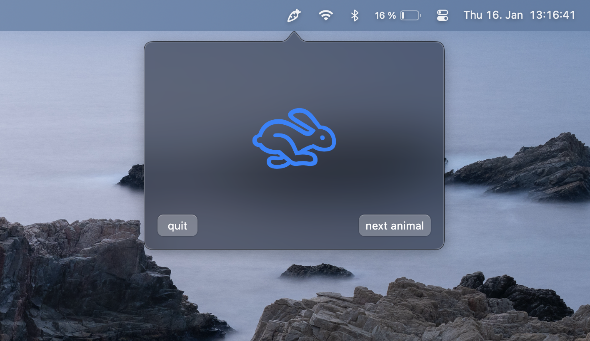
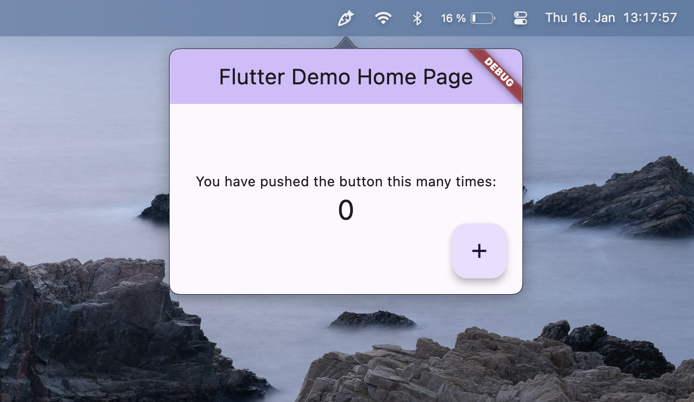

# *TEMPLATE*  &nbsp;&nbsp;  flutter_macos_tray

A template for creating a Flutter MacOS app within the system tray.

**with macos ui**

**with material ui**

## usage:

_sadly, as of now, there is no first class template system for Flutter._

**fork this repository** and build your app on top of it.

Use `flutter run` to run the app.

> **Note:** check if there are newer versions of the plugins used in this project.
